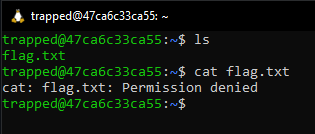
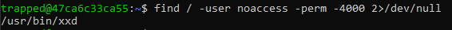
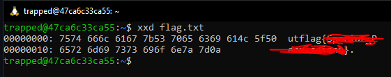

# Trapped in Plain Sight 1

## Introduction

Trapped in Plain Sight is a nice Misc appetizer that refreshes the challenger on Linux fundementals

## Step By Step Walk Through

***NT! Steps 1-2 can be skipped if you noticed that there is a 0x0 emoji in the description, 
which is a reference to hex and therefore the xxd executable***

### Step 1: Recon
After ssh-ing into the machine, I ran `ls` to check for any files in the home directory.
Realizing that there is a `flag.txt` file, I ran `cat` on it, only to realize I didn't have
the permissions to read it.

Since I didn't have read permissions, I decided to check who does using `ls -la`. The output
showed the user `noaccess` had permissions for it.

### Step 2: Weaponization

Step 1 got us useful info:
1. There is a `flag.txt` file that we need to read
2. Only the `noaccess` user can read the file

Since only the `noaccess` user could read the flag and I couldn't login as 
`noaccess`, I started to look for an executable that has a setuid of the `noaccess` user.

---

#### Thought Bubble: What is a SetUID?
It is the user ID of the process => a setting that causes the file to execute with the owner's permissions

---

I found the executable (`xxd`) by running `find / -name noaccess -perm 4000 2>/dev/null`. The `find` command's perm
and -4000 flag checks for a setuid bit set. 

### Step 3: Exploitation
Now that I know which executable can read the flag, I ran `xxd flag.txt` to get the flag.

 
